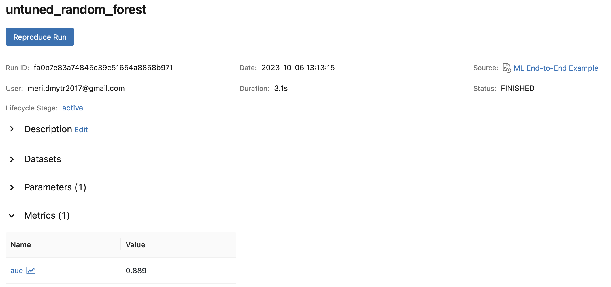
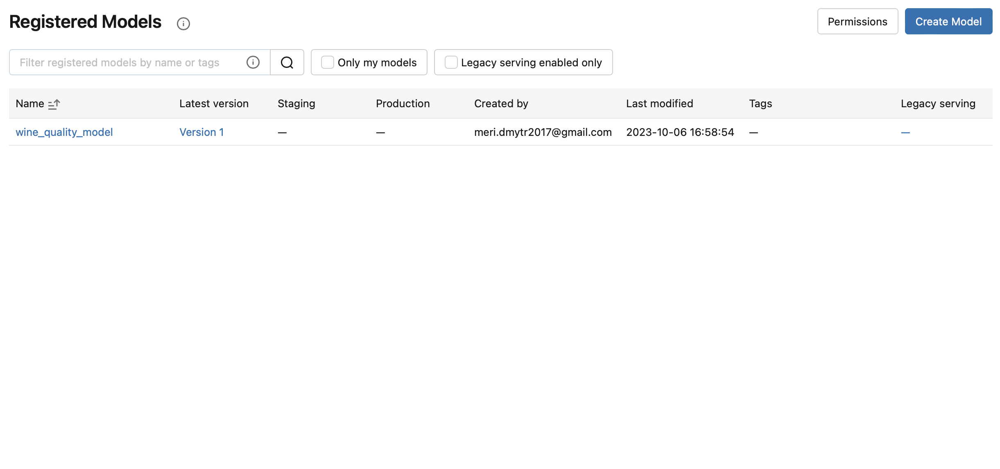
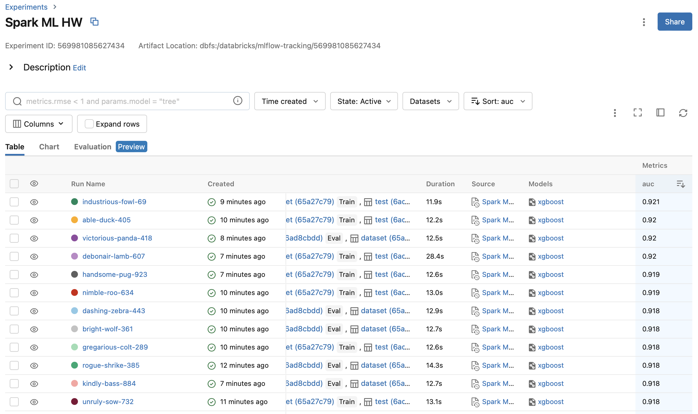

# Spark ML Homework
### Repository link https://github.com/MeriDm7/spark-ml-hw.git

#### 1. Download homework dataset.
#### 2. Extract the archive.
#### 3. Deploy infrastructure with terraform
```
terraform init
terraform plan -out terraform.plan
terraform apply terraform.plan
```
#### 4. Launch Databricks Workspace.
#### 5. Create a Single-node cluster. Install `mlflow`, `xgboost` and `hyperopt` libraries on the cluster.


#### 6. Import `ML End-to-End Example` notebook into the Databricks cluster. 

#### 7. Upload `winequality_white.csv` and `winequality_red.csv` datasets to Databricks File System (DBFS).

#### 8. Merge the two DataFrames into a single dataset, with a new binary feature `is_red` that indicates whether the wine is red or white.


#### 9. Visualize the data using Seaborn and matplotlib.


Normal distribution of quality.


Box plots display the correlation between quality and available features. From these charts, we can observe that only two variables exhibit a strong correlation with quality. The `alcohol` feature has a strong positive correlation with quality, while the  `density` feature is negatively correlated with quality.

#### 10. Check for missing values.


#### 11. Train/Test split.


#### 12.Building a Baseline Model - Random Forest Classifier.


AUC - ROC curve is a performance measurement for the classification problems at various threshold settings. ROC is a probability curve and AUC represents the degree or measure of separability. It tells how much the model is capable of distinguishing between classes. Higher the AUC, the better the model is at predicting 0 classes as 0 and 1 classes as 1.

Model `AUC value is 0.889`, which is quite good result.

#### 13. Feature importance model output. 


As illustrated by the boxplots shown previously, both alcohol and density are important in predicting quality.

#### 14. Register the model in the MLflow Model Registry



#### 15. Transition the model to production


#### 16. Run a parallel hyperparameter sweep to train machine learning models on the dataset

Use the xgboost library to train a more accurate new model. Run a parallel hyperparameter sweep to train multiple
models in parallel, using Hyperopt and SparkTrials. 


#### 17. Explore the results of the hyperparameter sweep with MLflow

Runs sorted by AUC metric:



The hyperparameter tuning significantly enhances the model's performance. Initial AUC = 0.889, now = 0.921

Parallel Coordinates plot:


The Parallel Coordinates Plot is useful in understanding the impact of parameters on a metric. We can see that all of the top performing runs have a low value for `min_child_weight` and `learning_rate`.


#### 18. Register the best performing model in MLflow.


#### 19. Update the production wine_quality_model model in the MLflow Model Registry


#### 20. Apply the registered model to another dataset using a Spark UDF.

Save the existing X_train data to a Delta table. Load the model into a Spark UDF, so it can be applied to the Delta table. Apply the model to the new data.

```py
udf_inputs = struct(*(X_train.columns.tolist()))

new_data = new_data.withColumn(
  "prediction",
  apply_model_udf(udf_inputs)
)
```


#### 21. Set up model serving for low-latency requests.


Compare the results from the deployed model and the trained model:


The results are are same!

